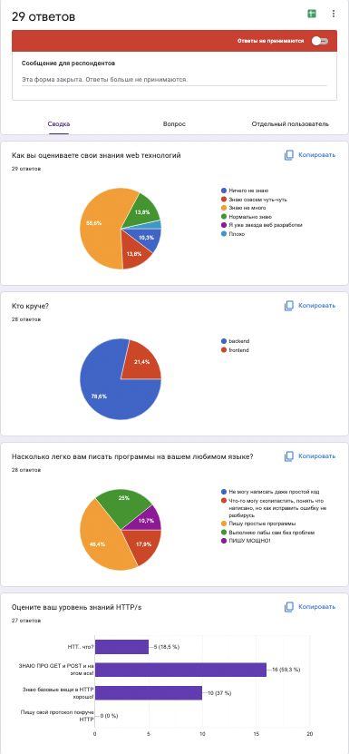
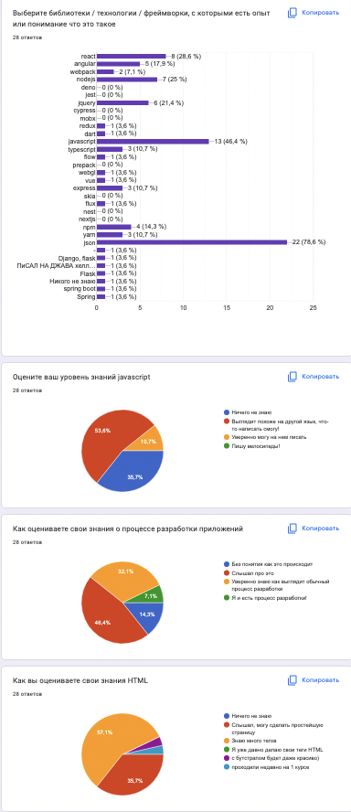
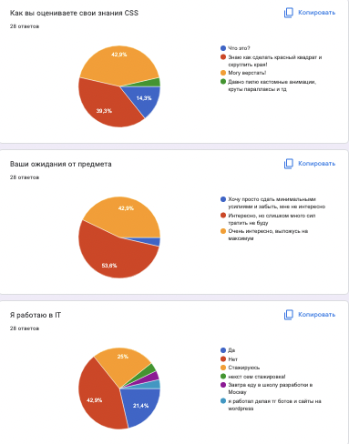

## 08.09.2022 33201 33211

Знакомство.
Провели опрос:

Ребята сказали, что был курс по верстке и java spring rest.

Вскользь упомянули назначение javascript, html, css.
На примере страницы Википедии проверили что произойдет если отключить javascript
Посмотрели на 2 способа подключения css / javascript (инлайн и через отдельный файл)
Заглянули в разные javascript файлы, посмотрели что там находится.
Обратили внимание на минифицированнаый js файл.

## 10.09.2022 33201, 17.09.2022 33211
Поговорили о понятии "WEB технологии"
Рассуждали о резнице [WEB](https://en.wikipedia.org/wiki/World_Wide_Web) и [internet](https://en.wikipedia.org/wiki/Internet).
Поговорили о том, где можно встретить web технологии
Поговорили про [electron](https://www.electronjs.org/), [webview](https://developer.android.com/reference/android/webkit/WebView),
[PWA](https://en.wikipedia.org/wiki/Progressive_web_app)
Немного обсудили разницу между понятиями сайт и приложение.

Попробовали создать простейшее приложение с помощью HTML и javascript: 2 поля ввода, кнопка сложить. при нажатии на кнопку "сложить", нужно считать значение из инпутов, сложить, и положить результат в отдельный элемент.

Тут мы несколько раз обратили внимание на то, что browser предоставляет api для чтения и модификации [DOM](https://developer.mozilla.org/ru/docs/Web/API/Document_Object_Model/Introduction)

Мы разобрали несколько методов поиска DOM элементов:
- [getElementById](https://developer.mozilla.org/ru/docs/Web/API/Document/getElementById)
- [getElementsByClassName](https://developer.mozilla.org/ru/docs/Web/API/Document/querySelector)
- [querySelector](https://developer.mozilla.org/ru/docs/Web/API/Document/getElementsByClassName)
- [getElementsByName](https://developer.mozilla.org/ru/docs/Web/API/Document/getElementsByName)
- [getElementsByTagName](https://developer.mozilla.org/ru/docs/Web/API/Document/getElementsByTagName)

Возник интересный момент что я не знал ограничения на то, каким может быть id элемента и мы поставили id="1", но селектор не сработал
Обещал узнать; Подробнее описано [тут](https://developer.mozilla.org/en-US/docs/Web/HTML/Global_attributes/id)

Далее мы считали свойство `value` элемента с типом [input](https://developer.mozilla.org/en-US/docs/Web/HTML/Element/input)
В этом свойстве лежала строка и нам нужно было получить из нее число. Для этого мы использовали [parseFloat](https://developer.mozilla.org/ru/docs/Web/JavaScript/Reference/Global_Objects/parseFloat) и [parseInt](https://developer.mozilla.org/ru/docs/Web/JavaScript/Reference/Global_Objects/parseInt)

Далее мы записали результат в `innerText` и увидели как браузер отобразил это изменение.

Потом мы решили убрать кнопку и считать результат по изменению в поле.
Мы рассмотрели понятие обработчика событий. 
Воспользовались `button.onclick = handleClick` и [addEventListener](https://www.w3schools.com/jsref/met_element_addeventlistener.asp)

Посмотрели как ведет себя обработчик событий `click`, `change`, `keydown`, `keyup`
Упомянули понятие активный элемент.

В течении пары мы использовали devtools console, потом мы решили положить код в скрипт, и подключить его. Мы поговорили про порядок парсинга и исполнения js
Упомянули про то, что можно контролировать загрузку и исполнения скрипта аттрибутами [async, defer](https://javascript.info/script-async-defer)
Кратко поговорили про то, как работают события в DOM https://learn.javascript.ru/introduction-browser-events
Обсудили зачем нужны [stopPropagation](https://developer.mozilla.org/ru/docs/Web/API/Event/stopPropagation), [preventDefault](https://developer.mozilla.org/ru/docs/Web/API/Event/preventDefault)

### Разбирали способы отправки запроса на сервер:

Разобрали способ [отправки данных на сервер без js](https://developer.mozilla.org/en-US/docs/Learn/Forms/Sending_and_retrieving_form_data)

Подметили что данные на сервер можно так же отправить тегами `script, link, a, img`  и тд.

Разобрали [пример отправки запроса](https://javascript.info/xmlhttprequest) с помощью [XMLHttpRequest](https://developer.mozilla.org/ru/docs/Web/API/XMLHttpRequest)
Поговорили о том что на основе этого апи есть куча библиотек, таких как [superagent](https://www.npmjs.com/package/superagent), [axios](https://github.com/axios/axios)
Поговорили про более современный API [fetch](https://developer.mozilla.org/ru/docs/Web/API/Fetch_API/Using_Fetch)
Упомянули про [Promise](https://developer.mozilla.org/en-US/docs/Web/JavaScript/Reference/Global_Objects/Promise)

Про javascript мы погоговорили очень отдаленно, в примерах мы использовали базовые конструкции языка:
- [объявление переменных](https://learn.javascript.ru/variables),
- [объявление функций](https://learn.javascript.ru/variables),
- [стрелочные функции](https://learn.javascript.ru/arrow-functions-basics)

Таким образом, мы разобрали самую базу:
Поиск, чтение аттрибутов, модификация DOM, обработка событий, отправка запросов на сервер и их обработка.

Крайне рекомендую, тем, кто не имеет никакого представления про WEB - изучить все ссылки, которые тут находятся, воспроизвести шаги, которые мы прошли.

## 24.09.2022 33201, 01.10.2022 33211

Поговорили про асинхронные запросы, поразбирались с 
[fetch api](https://developer.mozilla.org/en-US/docs/Web/API/Fetch_API), использовали конструкции [async](https://developer.mozilla.org/en-US/docs/Web/JavaScript/Reference/Statements/async_function), [await](https://developer.mozilla.org/en-US/docs/Web/JavaScript/Reference/Operators/await).
Разбирались с тем, как отправить несколько запросов параллельно. Как отправлять их последовательно. 

Смотрели на таймлайн запросов в devtools. Разбирались как найти код инициировавший запрос, кратко поразбирались на что тратится время при отправке запросов.

Поговорили о самых популярных функциях JSON.parse, JSON.stringify и об их применении в глубоком копировании.

В качестве тестового API использовали

Поговорили про [websocket](https://javascript.info/websocket), его применение, [посмотрели в devtools пакеты](https://developer.chrome.com/docs/devtools/network/) у telegram, как более удачный пример посмотрели на то, что отправляет по web сокету [сервис доставки цветов](https://spb.flowers-sib.ru), при попытке написать в чат.

Поговорили про [longpolling](https://javascript.info/long-polling)

Упомянули про [postman](https://www.postman.com/), который часто используется для проверки работы API.

Установили [nodejs](https://nodejs.org/), поговорили про его назначение, вскользь затронули вопросы производительности nodejs.
Поиграли с nodejs терминалом, создали [первый httpServer на nodejs](https://nodejs.org/en/knowledge/HTTP/servers/how-to-create-a-HTTP-server/).

Простейший пример long polling на безе nodejs сервера можно посмотреть [тут](https://github.com/stepancar-web-programming/auto-page-reload)

Поговорили про [встроенные пакеты nodejs](https://www.w3schools.com/nodejs/ref_modules.asp), о том как их импортировать и использовать.

Создали свой модуль, с парой функций `sum, sub`, имортировали его внутри indexjs c помощью [require](https://nodejs.org/en/knowledge/getting-started/what-is-require/) и конструкции [import](https://developer.mozilla.org/en-US/docs/Web/JavaScript/Reference/Statements/import).

Поговорили про пакеты, менеджер пакетов [npm](https://en.wikipedia.org/wiki/Npm_(software)), registry [npmjs.com](https://www.npmjs.com/), 
Поговорили про [package.json](https://docs.npmjs.com/cli/v8/configuring-npm/package-json) и его структуру, обсудили некоторые проблемы зависимостей в мире front-end
Обсудили назначение файла [package-lock.json](https://docs.npmjs.com/cli/v8/configuring-npm/package-lock-json)

## 08.10.2022 33201, 15.10.2022 33211

Обсудили понятие [Boilerplate code](https://en.wikipedia.org/wiki/Boilerplate_code)

Для изучения того, что делают сборщики ресурсов скачали проект https://github.com/taniarascia/webpack-boilerplate

Этот проект нельзя назвать идеальным, но для демонстрации он хорошо подходит.

Мы изучили команды которые есть в этом проекте.
Разобрались с понятием [code linting](https://en.wikipedia.org/wiki/Lint_(software)), посмотрели как это работает на примере [eslint](https://eslint.org/), расмотрели примеры конфигов. Обсудили популярные пресеты [1](https://github.com/eslint/eslint/blob/main/conf/eslint-recommended.js) [2](https://www.npmjs.com/package/eslint-config-airbnb)

Обсудили понятие форматирования кода на примере [prettier](https://prettier.io/)
Изучили его конфиг.

Поговорили про вызовы, с которыми сталкиваются фронт энд разработчики при желании использовать новые фичи браузеров.

Рассмотрели примеры преобразования javascript c помощью [babel](https://babeljs.io/), изучили его конфиг в проекте.

Обсудили проблемы создания такого конфига, рассмотрели идею [browserlist](https://github.com/browserslist/browserslist)

Запустили проект, посмотрели на то, какие запросы отправлялись браузером, что находилось внутри DOM в результате рендеринга страницы. 

Заметили несостыковки между исходным кодом и результатом.
Странные импорты картинок в коде на `javascript`, разницу в путях к ресурсам в коде и на отрендеренной странице
Заметили запрос на websocket, код которого мы в приложении не нашли.

Начали говорить о [webpack](https://webpack.js.org/) и его предназначении.
Разобрались с понятием [entrypoint](https://webpack.js.org/concepts/entry-points/)

Обсудили понятие [bundling](https://matcha.fyi/bundling-javascript/). Для тех студентов, кто хочет разобраться как это работает можно читать официальную документацию `webpack`, там много кросс сылок, [одна из них рекомендована к просмотру](https://www.youtube.com/watch?v=Gc9-7PBqOC8)

Посмотрели на то, как выглядит конечный bundle.

Разобрали понятие [webpack-loaders](https://webpack.js.org/concepts/loaders/) на примере конфига.

Обсудили необходимость разных конфигов для `production` и `development`

По каждому отдельному типу ресурса проговорили как именно он попадает в бандл.
Обсудили назначение [base64](https://en.wikipedia.org/wiki/Base64) на примере загрузки [svg](https://en.wikipedia.org/wiki/Scalable_Vector_Graphics)

Обсудили что такое [webpack-dev-server](https://webpack.js.org/configuration/dev-server/) и какие задачи он решает и поняли откуда взялся тот самый `websocket` connection, код для которого мы не смогли найти.

Таким образом, мы изучили вопрос сборки проекта.

Обсудили так же что есть другие инструменты сборки, такие как [gulp](https://gulpjs.com/), [grunt](https://gruntjs.com/), [vitejs](https://vitejs.dev/guide/why.html) и тд.

Создали проект с помощью [react-create-app](https://reactjs.org/docs/create-a-new-react-app.html)

Заметили что созданный `boilerplate` на содержит явных конфигов, которые мы видели в предыдущем проекте.
Обсудили конфигурацию `eslint`, `browserlist` внутри `package.json`, изучили [команды](https://create-react-app.dev/docs/available-scripts)
Проговорили назначение команды [eject](https://create-react-app.dev/docs/available-scripts/#npm-run-eject)

Изучили код проекта, снова обсудили каким образом загружены разные типы ресурсов.

Начали изучать код компонентов на react.
Мы не стали разбирать что такое реакт, как он работает, начали с того что мы примерно понимаем как им пользоваться.

Обсудили что такое [jsx](https://reactjs.org/docs/introducing-jsx.html)

Посмотрели на то, как написать код [без jsx](https://reactjs.org/docs/introducing-jsx.html#jsx-represents-objects)
Можно так же посмотреть во что превращается ваш `jsx` код [тут](https://infoheap.com/online-react-jsx-to-javascript/)

Очень кратко обсудили понятие `компонент` ,
Разобрали на примерах как сгенерить представление списка, как в `jsx` сделать условный рендеринг

Поговорили о том, как [пробрасывать параметры в компонент](https://reactjs.org/docs/components-and-props.html).

[Как обрабатывать события](https://reactjs.org/docs/handling-events.html)

Не разбирались с тем как он работает.

Вспомнили еще раз про [Destructuring_assignment в js](https://developer.mozilla.org/en-US/docs/Web/JavaScript/Reference/Operators/Destructuring_assignment)